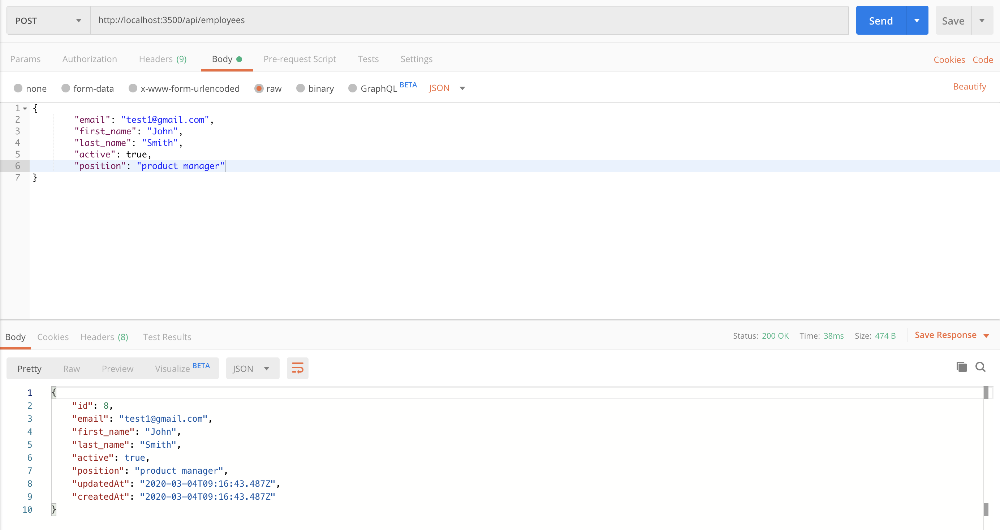
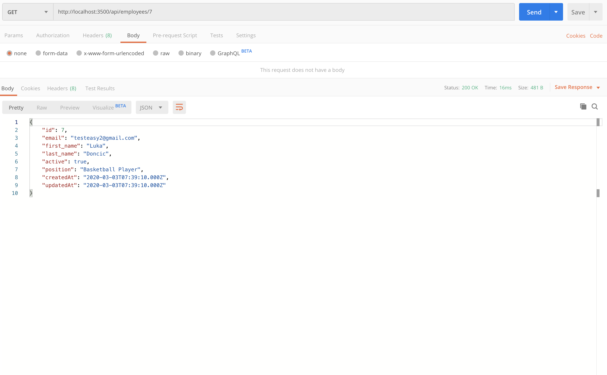
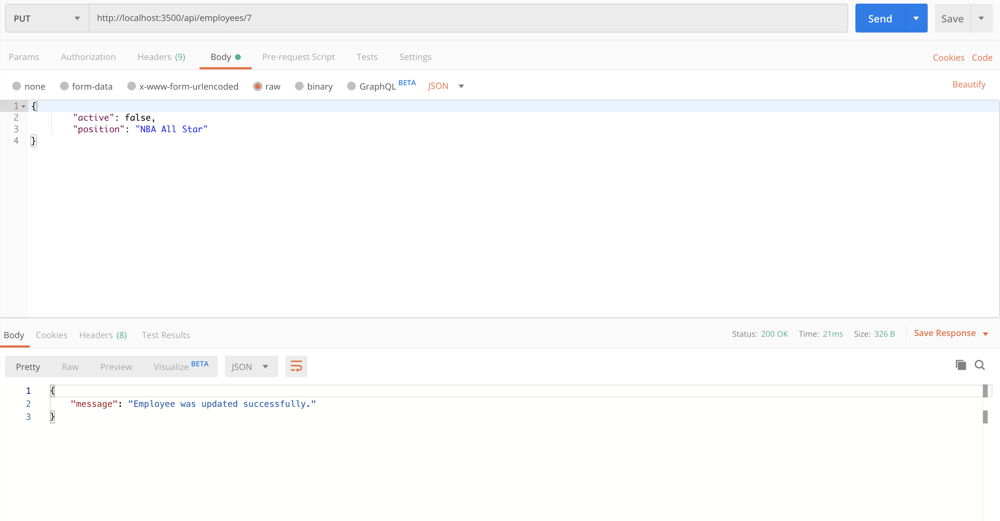
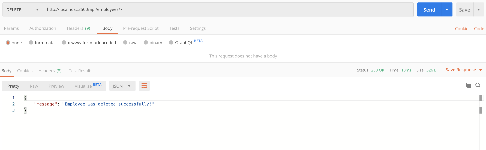

# employee-portal

Dashboard for employees. Local CRUD app using React, Node, and MySQL.

## Installation

1.) `bash yarn install`

2.) `bash cd client`

    `bash yarn install`

3.) Create the database in local mysql using the queries in the `bash seed.sql` file.

4.) Create env file to fill in mysql configuration. Use the `bash test.env` file as an example of how the env file should look like. Choose the database name from the seed.sql file.

5.) `bash yarn run start`

    This command concurrently starts the server as well as starts the react app.

## Rest Apis

The react app uses a GET request, but there are other requests as well. I use Postman to call my routes. Pictures are provided.

Api routes start with /api/employees

1.) Create a new employee using POST / Api

2.) Retrieve all employees using GET / Api

3.) Retrieve a single employee by id using GET /:id Api

4.) Update a Tutorial using PUT /:id Api

5.) Update a Tutorial using DELETE /:id Api

